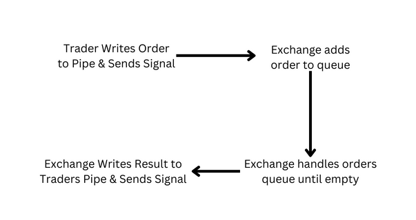
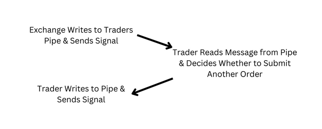

1. Describe how your exchange works. 
   There were 3 main design decisions in the implementation of the exchange. Firstly, the FIFO pipes to read and write between the exchange and traders, secondly the order queue to store incoming orders in their correct order such that the exchange can handle periods of increased volume, and lastly the data structure storing the orderbook for each product. The exchange functions by receiving a signal from a trader which indicates that an order has been written to the traders’ pipe, upon receiving this signal the exchange adds the traders id to an order queue and the exchange begins processing the all orders in the queue until it is empty. In processing each order the exchange shall perform the desired logic such as BUY and then send the resulting impact to the appropriate traders or all traders by writing to the exchange pipe corresponding to the respective trader.
   

2. Describe your design decisions for the trader and how it's fault-tolerant. 
   Design Decisions: 
   The trader is designed to ‘wake up’ upon receiving a sigusr1 signal and new information from the exchange pipe. It can then process the new information and respond to the exchange accordingly by writing to the trader pipe. 
   Fault-tolerant: 
   Any errors caught in the handling of an exchange message results in the trader simply ignoring the message and going back to ‘rest’. This means that upon encountering an error the trader does not make any changes which may have side-effects. Note this does not necessarily mean that there are no errors in the program it simply means that all errors which are accounted for ensure the trader operates in a fault-tolerant manner. 
   Efficient: 
   The trader is efficient as it rests until a new signal is received from the exchange. This means that only when some new change occurs in the orderbook of the exchange does the trader ‘wake up’ to access and respond accordingly.
   

3. Describe your tests and how to run them.
